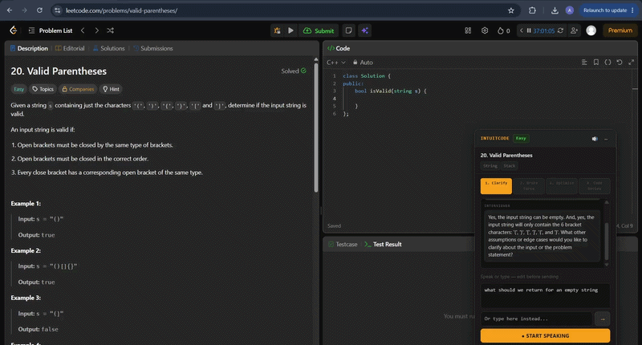
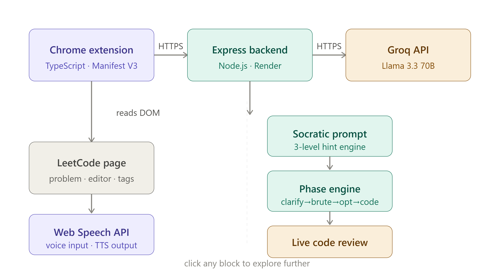

# IntuitCode

**AI Voice Interviewer for LeetCode** — explain your intuition before you code.

IntuitCode is a Chrome extension that turns LeetCode into a real technical interview simulator. Before writing a single line of code, you explain your approach out loud to an AI interviewer that asks clarifying questions, gives Socratic hints, and reviews your code — just like a real SDE interview.



<!-- > 📺 [Watch full demo ]  -->

<!-- > 🏪 [Install from Chrome Web Store](https://chrome.google.com/webstore/detail/intuitcode/bfhkmfbapdfepkhkchaedbdllkafcbhm) -->

---

## Why I built this

Most LeetCode practice optimizes for the wrong skill — writing correct code in isolation. Real interviews test something different: can you think out loud, explain your reasoning under pressure, and respond to hints without being handed the answer. IntuitCode forces that exact skill.

## How it works

1. Open any LeetCode problem — the panel automatically detects the title, difficulty, and tags
2. Click **● START SPEAKING** and verbally explain your approach out loud
3. The AI interviewer responds with a clarifying question or a targeted hint — never the solution
4. Progress through 4 structured interview phases: **Clarify → Brute Force → Optimize → Code Review**
5. In the code phase, click **⌕ Review My Code** for live feedback on your actual editor content
6. Get structured closure feedback (time/space complexity, what you did well) and suggested follow-up problems using the same pattern

## 🎙️ Use your voice for the real experience

IntuitCode supports both voice input and text input. The text input is available as a fallback — useful for quick demos, quiet environments, or correcting misheard words after speaking.

**For actual interview preparation, always use voice.** Real SDE interviews require you to speak your reasoning out loud, think verbally under pressure, and respond naturally to follow-up questions. Typing your answers skips the exact muscle you're trying to build. The transcript box is editable — speak first, then fix any misheard words before sending.

## Features

- **Voice-first interaction** — Web Speech API for live transcription, Speech Synthesis for spoken interviewer responses
- **Editable transcript** — speak your answer, then click the transcript to fix any misheard words before sending
- **Socratic hint engine** — 3-level progressive hints that never reveal the solution directly
- **4-phase interview structure** — mirrors real interview flow instead of an open-ended chat loop
- **Live code review** — reads your actual LeetCode editor content and gives targeted, bug-specific feedback on demand
- **Pattern-based suggestions** — recommends similar problems once you solve one correctly
- **Resizable and draggable panel** — position it anywhere on screen, resize to fit your workflow
- **Secure architecture** — API keys are never exposed client-side; all AI calls route through a deployed backend proxy

## Tech stack

| Layer           | Technology                                                  |
| --------------- | ----------------------------------------------------------- |
| Extension       | TypeScript, Chrome Extension Manifest V3, Webpack           |
| Voice I/O       | Web Speech API (SpeechRecognition + SpeechSynthesis)        |
| AI              | Groq API (Llama 3.3 70B) via custom Socratic system prompts |
| Backend         | Node.js, Express, deployed on Render                        |
| DOM Integration | MutationObserver for LeetCode SPA navigation detection      |

## Architecture



The extension never holds the AI API key — every request is proxied through a backend service, which keeps credentials secure and allows for future rate limiting or usage tracking.

## Local development

### Extension

```bash
git clone https://github.com/achawla19/intuitcode.git
cd intuitcode
npm install
npm run build
```

Load the `dist/` folder as an unpacked extension in `chrome://extensions`.

For active development:

```bash
npm run watch
```

Rebuilds automatically on every file save. Refresh the extension in `chrome://extensions` after each rebuild.

### Backend

```bash
git clone https://github.com/achawla19/intuitcode-backend.git
cd intuitcode-backend
npm install
npm run dev
```

Requires a `.env` file with:

```
GROQ_API_KEY=your_key_here
```

Free API key at [console.groq.com](https://console.groq.com). Update `API_URL` in `src/interviewer.ts` to `http://localhost:3000/chat` for local development.

## Design decisions

**Why phases instead of an open chat loop?** Early versions had the interviewer and user going back and forth indefinitely, which felt repetitive and didn't mirror a real interview. Structuring it into Clarify → Brute Force → Optimize → Code Review gives the conversation a clear arc and lets the user jump to any phase directly.

**Why hints instead of answers?** The entire premise of the tool is verbal reasoning practice. An AI that gives away the solution defeats the purpose — the system prompt explicitly enforces a 3-level Socratic hint progression that nudges without revealing.

**Why editable transcript?** The Web Speech API occasionally mishears technical terms — "hashmap" becomes "has map", problem names get garbled. Rather than forcing users to re-speak, the transcript is fully editable before sending. Speak first, fix what's wrong, then send.

**Why a backend proxy?** Shipping an API key inside a Chrome extension's bundled JavaScript exposes it to anyone who inspects the extension source. A minimal Express proxy keeps the key server-side while adding negligible latency.

**Why Llama 3.3 70B over GPT-4 or Claude?** Free tier on Groq with sub-second response times. For a voice interview tool, latency matters — a 3-second wait after speaking breaks the conversational feel. Groq's inference speed keeps the exchange natural.

## Roadmap

- [ ] Session history and progress tracking across problems
- [ ] Support for additional platforms (HackerRank, Codeforces)
- [ ] User-configurable interview difficulty and strictness
- [ ] Multi-language code review (currently best with C++/Python/Java)
- [ ] Timed mock interview mode with session summary

## License

MIT

---

Built by [Akshit Chawla](https://github.com/achawla19) — [LinkedIn](https://www.linkedin.com/in/akshit-chawla-8229a528a/) — [GitHub](https://github.com/achawla19)
